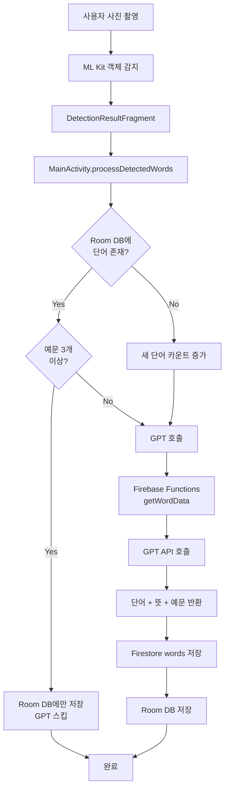
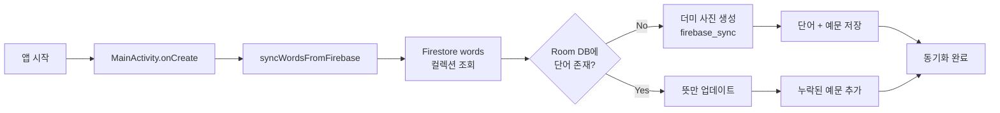
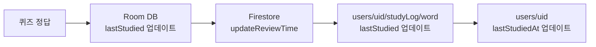
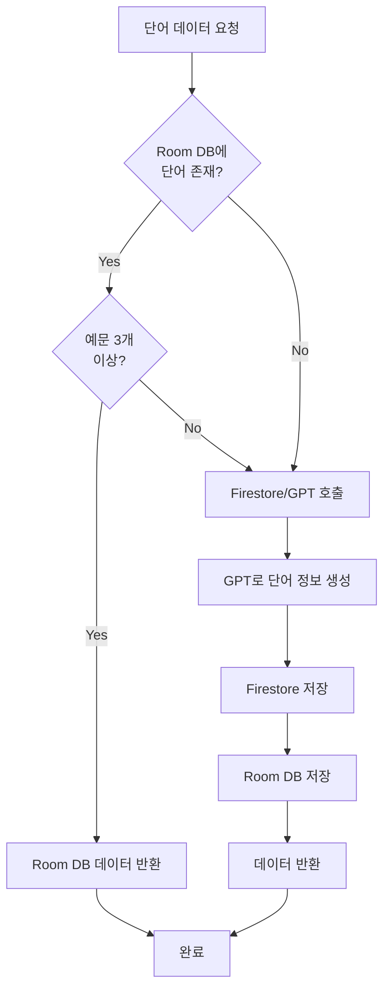

# Chalkak 앱 데이터베이스 아키텍처

## 📊 전체 구조 개요

Chalkak 앱은 **하이브리드 데이터베이스 아키텍처**를 사용합니다:
- **로컬 DB**: Room Database (SQLite 기반)
- **클라우드 DB**: Firebase Firestore
- **외부 API**: Firebase Functions (GPT 연동)

---

## 🏗️ Room Database (로컬 저장소)

### 테이블 구조

#### 1. `photo_logs` 테이블
사용자가 찍은 사진 정보를 저장합니다.

| 컬럼명 | 타입 | 설명 |
|--------|------|------|
| `photoId` | Long (PK) | 사진 고유 ID (자동 생성) |
| `local_image_path` | String | 기기 내 이미지 경로 |
| `created_at` | Long | 사진 생성 시간 (타임스탬프) |

**특수 케이스**: `local_image_path = "firebase_sync"`인 더미 사진은 Firebase에서 동기화된 단어들을 저장하기 위한 가상 사진입니다.

---

#### 2. `detected_objects` 테이블
사진에서 감지된 영어 단어들을 저장합니다.

| 컬럼명 | 타입 | 설명 |
|--------|------|------|
| `objectId` | Long (PK) | 객체 고유 ID (자동 생성) |
| `parent_photo_id` | Long (FK) | 부모 사진 ID → `photo_logs.photoId` |
| `english_word` | String | 감지된 영어 단어 (예: "Apple") |
| `korean_meaning` | String | 한국어 뜻 (예: "사과") |
| `bounding_box` | String | 사진 내 위치 정보 (JSON 형식) |
| `last_studied` | Long | 마지막 학습 시간 (0 = 미학습) |

**인덱스**:
- `parent_photo_id` (조회 성능 향상)
- `english_word` (단어 검색 최적화)

**외래키 제약**:
- `parent_photo_id` → `photo_logs.photoId` (CASCADE DELETE)

---

#### 3. `example_sentences` 테이블
각 단어의 예문들을 저장합니다.

| 컬럼명 | 타입 | 설명 |
|--------|------|------|
| `sentenceId` | Long (PK) | 예문 고유 ID (자동 생성) |
| `word_id` | Long (FK) | 단어 ID → `detected_objects.objectId` |
| `sentence` | String | 영어 예문 |
| `translation` | String | 한국어 번역 |

**인덱스**:
- `word_id` (예문 조회 최적화)

**외래키 제약**:
- `word_id` → `detected_objects.objectId` (CASCADE DELETE)

---

### Room DAO (데이터 접근 객체)

#### PhotoLogDao
```kotlin
- insert(photoLog): Long              // 사진 저장 후 ID 반환
- getAllPhotos(): List<PhotoLog>      // 모든 사진 조회 (최신순)
- deleteAllPhotos()                   // 모든 사진 삭제
```

#### DetectedObjectDao
```kotlin
- insert(obj): Long                                    // 단어 저장
- isWordExist(word): Boolean                          // 단어 존재 여부 확인
- updateLastStudied(word, timestamp)                  // 학습 시간 업데이트
- getObjectsByPhotoId(photoId): List<DetectedObject>  // 사진별 단어 조회
- updateMeaning(word, meaning)                        // 뜻 업데이트
- getObjectByEnglishWord(word): DetectedObject?       // 단어로 조회
- getAllDetectedObjects(): List<DetectedObject>       // 모든 단어 조회
- deleteAllDetectedObjects()                          // 모든 단어 삭제
```

#### ExampleSentenceDao
```kotlin
- insert(sentence)                                  // 예문 저장
- getSentencesByWordId(wordId): List<ExampleSentence>  // 단어별 예문 조회
- getAllExampleSentences(): List<ExampleSentence>   // 모든 예문 조회
- deleteAllExampleSentences()                       // 모든 예문 삭제
```

---

## ☁️ Firebase Firestore (클라우드 저장소)

### 컬렉션 구조

#### 1. `users` 컬렉션
사용자 정보 및 학습 통계를 저장합니다.

**문서 ID**: `uid` (Firebase Auth UID)

**필드**:
```javascript
{
  email: String,              // 이메일
  nickname: String,           // 닉네임
  fcmToken: String,          // FCM 푸시 알림 토큰
  lastStudiedAt: Timestamp,  // 마지막 학습 시간
  settings: {
    pushTime: String,        // 알림 시간 (예: "20:00")
    targetWordsPerDay: Int   // 하루 목표 단어 수
  },
  stats: {
    totalWordCount: Int,     // 총 학습 단어 수
    reviewStreak: Int        // 연속 복습 일수
  }
}
```

**서브컬렉션**: `studyLog`
- 각 단어별 학습 기록을 저장
- 문서 ID: 단어 (소문자)
- 필드: `lastStudied` (Timestamp)

---

#### 2. `words` 컬렉션
GPT로 생성된 단어 데이터를 저장합니다 (캐시 역할).

**문서 ID**: 단어 (소문자)

**필드**:
```javascript
{
  originalWord: String,      // 원본 단어 (대소문자 유지)
  meaning: String,           // 한국어 뜻
  examples: [                // 예문 배열
    {
      sentence: String,      // 영어 예문
      translation: String    // 한국어 번역
    }
  ]
}
```

---

### Firestore Repository 메서드

#### 사용자 관리
```kotlin
- saveUser(uid, email, nickname, fcmToken)  // 사용자 정보 저장
- updateNickname(uid, nickname)             // 닉네임 업데이트
```

#### 학습 통계
```kotlin
- addNewWordCount(uid)                // 새 단어 카운트 증가
- updateReviewTime(uid, word)         // 복습 시간 업데이트
```

#### 단어 데이터
```kotlin
- fetchWordFromGPT(word, onSuccess, onFailure)  // GPT로 단어 정보 가져오기
- saveWordToFirebase(wordDto)                   // Firestore에 단어 저장
- getAllWordsFromFirebase(): List<WordDTO>      // 모든 단어 가져오기
```

---

## 🔄 데이터 흐름

### 1️⃣ 사진 촬영 및 단어 감지 플로우



**주요 로직** ([MainActivity.kt:372-510](file:///c:/Users/user/Desktop/ITM/25-2/MP/chalkak-app/app/src/main/java/com/example/chalkak/MainActivity.kt#L372-L510)):
1. 사진을 `photo_logs` 테이블에 저장
2. 감지된 단어 최대 2개만 처리 (`MAX_DETECTED_ITEMS = 2`)
3. 각 단어마다:
   - Room DB에 존재하고 예문이 3개 이상이면 → GPT 호출 스킵
   - 새 단어이거나 예문 부족하면 → GPT 호출
4. GPT 응답을 Firestore와 Room DB 양쪽에 저장

---

### 2️⃣ 앱 시작 시 동기화 플로우



**주요 로직** ([MainActivity.kt:512-579](file:///c:/Users/user/Desktop/ITM/25-2/MP/chalkak-app/app/src/main/java/com/example/chalkak/MainActivity.kt#L512-L579)):
1. Firestore `words` 컬렉션의 모든 단어 가져오기
2. `localImagePath = "firebase_sync"`인 더미 사진 생성 (없으면)
3. 각 단어를 Room DB에 저장 (중복 체크)
4. 기존 단어는 뜻 업데이트 + 누락된 예문만 추가

---

### 3️⃣ 퀴즈 정답 시 플로우



**주요 로직**:
- Room DB: `DetectedObjectDao.updateLastStudied(word, timestamp)`
- Firestore: `FirestoreRepository.updateReviewTime(uid, word)`

---

### 4️⃣ 단어 데이터 로딩 플로우 (WordDataLoaderHelper)



**특징**:
- 로컬 우선 전략 (Local-First)
- 자동 폴백: Room DB 실패 시 Firestore/GPT로 자동 전환
- 예문 중복 방지: 이미 존재하는 예문은 저장하지 않음

---

## 🔐 Firebase Authentication

### 로그인 플로우
1. Google 로그인 (Credential Manager)
2. Firebase Auth로 인증
3. FCM 토큰 생성
4. Firestore `users` 컬렉션에 사용자 정보 저장

### 사용자 정보 관리
- **UserPreferencesHelper**: Firebase Auth + SharedPreferences 통합 관리
- **로그아웃**: Firebase Auth 로그아웃 + 로컬 데이터 유지 (Room DB는 삭제 안 함)

---

## 📡 Firebase Cloud Functions

### `getWordData` 함수
- **위치**: `asia-northeast3` (서울 리전)
- **입력**: `{ word: String }`
- **출력**:
```javascript
{
  originalWord: String,
  meaning: String,
  examples: [
    { sentence: String, translation: String }
  ],
  isError: Boolean
}
```
- **역할**: GPT API를 호출하여 단어의 뜻과 예문 생성

---

## 🎯 데이터 모델 (DTO)

### WordDTO
```kotlin
data class WordDTO(
    val originalWord: String,           // 원본 단어
    val meaning: String,                // 한국어 뜻
    val examples: List<ExampleItem>,    // 예문 리스트
    val createdAt: Timestamp?           // 생성 시간
)
```

### ExampleItem
```kotlin
data class ExampleItem(
    val sentence: String,      // 영어 예문
    val translation: String    // 한국어 번역
)
```

### UserDTO
```kotlin
data class UserDTO(
    val nickname: String,
    val email: String,
    val fcmToken: String,
    val lastStudiedAt: Timestamp?,
    val settings: UserSettings,
    val stats: UserStats
)
```

---

## 🔍 최적화 전략

### 1. N+1 쿼리 방지
- 배치 로딩: 모든 단어를 한 번에 조회 후 메모리에서 필터링
- 예문 그룹화: `groupBy`로 효율적인 조회

### 2. 캐싱 전략
- Firestore `words` 컬렉션이 GPT 응답 캐시 역할
- 동일 단어 재요청 시 GPT 호출 스킵

### 3. 인덱스 활용
- `english_word`, `parent_photo_id`, `word_id`에 인덱스 설정
- 조회 성능 향상

### 4. Cascade 삭제
- 사진 삭제 시 관련 단어 및 예문 자동 삭제
- 데이터 일관성 유지

---

## 📝 주요 상수

```kotlin
MAX_DETECTED_ITEMS = 2        // 사진당 최대 처리 단어 수
MIN_EXAMPLES_REQUIRED = 3     // GPT 호출 스킵 기준 예문 수
```

---

## 🚀 데이터 동기화 정책

### 로컬 → 클라우드
- 새 단어 감지 시 Firestore에 자동 저장
- 퀴즈 정답 시 학습 기록 업데이트

### 클라우드 → 로컬
- 앱 시작 시 자동 동기화
- 더미 사진(`firebase_sync`)을 통해 클라우드 전용 단어 저장

### 충돌 해결
- Firestore가 진실의 원천 (Source of Truth)
- 로컬 데이터는 Firestore 데이터로 덮어쓰기
